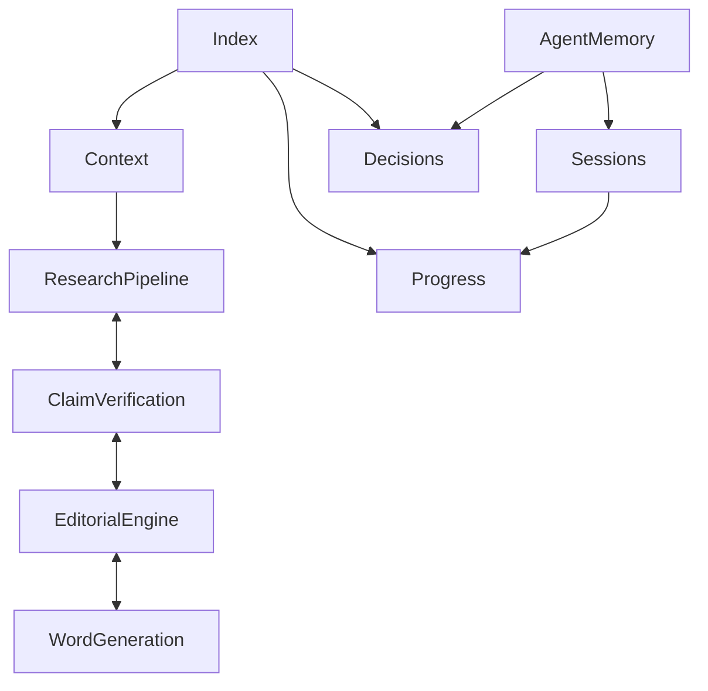

# Memory index

Open the repository root as an Obsidian vault so links to specifications and
memory notes resolve together. No Obsidian plugins or settings are required.

## Essential state

- [[memory/PROJECT_CONTEXT|Project context]]
- [[memory/PROGRESS|Progress and validation]]
- [[memory/DECISIONS|Decision index]]
- [[PROJECT_BRIEF|Product requirements baseline]]
- [[DEVELOPMENT_PLAN|Phase index]]

Phase 0 — Memory Foundation is complete and awaiting review, authorized by Prompt 2.
Approval of Phase 0 deliverables and authorization for Phase 1 are pending.

## Selective retrieval

| Task | Relevant concepts |
| --- | --- |
| Sources, cadence, research history | [[memory/concepts/research-pipeline|Research Pipeline]] |
| Evidence and factual claims | [[memory/concepts/claim-verification|Claim Verification]] |
| Story selection and writing | [[memory/concepts/editorial-engine|Editorial Engine]] |
| Magazine output | [[memory/concepts/word-generation|Word Generation]] |
| Memory, handoffs, validation | [[memory/concepts/agent-memory|Agent Memory]] |

Load only the relevant row and its needed dependencies after the essential state.

## Recently changed records

- [[memory/CONTEXT_RECOVERY_REPORT|Repository-only context recovery report]]
- [[memory/sessions/2026-10-09-phase-0|Phase 0 session and authorization]]
- [[memory/decisions/ADR-0001-markdown-memory|Approved memory mandate]]
- [[memory/decisions/ADR-0002-memory-conventions|Proposed implementation conventions]]
- [[memory/archive/README|Archive policy]]

## Human overview

The diagram is explanatory; the wikilinks in these notes form the navigable graph.
